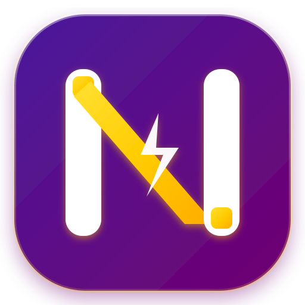

<p align="center">
  
</p>

<h1 align="center">NirvaPay</h1>

<p align="center">
  <strong>Enterprise-Grade Self-Hosted Multi-Merchant QRIS & Settlement Gateway</strong><br />
  High-Density Dynamic EMVCo QRIS Generator, Direct Mutation Engine, and Webhook Aggregator SaaS.
</p>

<p align="center">
  <a href="#-fitur-utama">Fitur Utama</a> •
  <a href="#-arsitektur--teknologi">Arsitektur</a> •
  <a href="#-instalasi--menjalankan">Instalasi</a> •
  <a href="#-rest-api-reference">REST API</a> •
  <a href="#-webhook-integration">Webhook</a> •
  <a href="#-keamanan--best-practices">Keamanan</a>
</p>

---

## 📌 Ringkasan Ekosistem

**NirvaPay** adalah platform SaaS payment gateway mandiri (*self-hosted*) berkinerja tinggi yang dirancang khusus untuk memproses pembayaran instan berbasis QRIS (Standar EMVCo Nasional), rekonsiliasi mutasi e-wallet otomatis, notifikasi realtime via WebSocket & Telegram Bot, serta manajemen multi-merchant multi-channel.

NirvaPay dibangun dengan filosofi **Anti-AI Slop & High-Density UI**: mengedepankan tampilan bersih, solid, non-glassmorphism, dengan kontras tajam palet ungu-emas (*Royal Purple* `#700070`, *Tekhelet* `#4A1B9D`, dan *Jonquil Gold* `#FFCC00`).

---

## 🚀 Fitur Utama

- ⚡ **Dynamic EMVCo QRIS Engine**: Mengonversi string statis merchant (GoPay, DANA, BCA, ShopeePay, dll) menjadi Dynamic QRIS dengan nominal dan kode unik transaksi secara presisi di level bit payload (Tag `54`, `58`, `62`, dan `63` CRC16-CCITT).
- 🔄 **Real-Time Mutation Matcher**: Pencocokan otomatis mutasi transaksi masuk dari webhook e-wallet/aggregator (BukaOlshop, GoPay Merchant, DANA Business) dengan toleransi kode unik 3 digit.
- 📡 **Instant WebSocket State Stream**: Checkout page pelanggan (`/pay/{invoice_id}`) auto-update status ke `PAID` dalam hitungan milidetik begitu mutasi terkonfirmasi tanpa reload halaman.
- 👥 **Multi-Tenant & Multi-Merchant Isolation**: Sistem API key berpasangan (`Public Key` `np_live_pub_...` & `Secret Key` `np_live_sec_...`) untuk mengisolasi saldo, invoice, mutasi, dan webhook tiap merchant.
- 🔔 **Real-Time Telegram Dispatcher**: Notifikasi transaksi lunas, kegagalan pembayaran, dan alert sistem langsung ke channel / Telegram DM admin.
- 📊 **High-Density Dashboard**: Antarmuka kontrol merchant dengan analitik grafik omzet, log mutasi, simulasi QRIS tester, live payload inspector, dan ekspor laporan CSV instan.
- 🛡️ **Zero-Trust SSRF & Payload Sanitizer**: Dilengkapi sanitasi URL webhook, proteksi subnet internal (RFC 1918), verifikasi tanda tangan HMAC-SHA256, dan proteksi CSRF/CORS ketat.

---

## 🏗️ Arsitektur & Teknologi

```text
┌────────────────────────────────────────────────────────┐
│                   NirvaPay Gateway                     │
│                  (Port :8098 / HTTPS)                  │
└──────────────────────────────────┬─────────────────────┘
                                   │
         ┌─────────────────────────┼─────────────────────────┐
         ▼                         ▼                         ▼
┌──────────────────┐      ┌──────────────────┐      ┌──────────────────┐
│  Client Checkout │      │  Merchant Admin  │      │ Direct Ingestion │
│   /pay/{id}      │      │    /dashboard    │      │     /webhook     │
│ (Live WebSocket) │      │  (API & Reports) │      │  (GoPay / DANA)  │
└──────────────────┘      └──────────────────┘      └──────────────────┘
                                   │
                 ┌─────────────────┴─────────────────┐
                 ▼                                   ▼
      ┌─────────────────────┐             ┌─────────────────────┐
      │  EMVCo CRC16 Engine │             │ SQLite / PostgreSQL │
      │ Dynamic QR Modifier │             │ Async SQLAlchemy DB │
      └─────────────────────┘             └─────────────────────┘
```

### Tech Stack:
- **Backend**: Python 3.11+, FastAPI (Asynchronous ASGI).
- **ORM & Database**: SQLAlchemy 2.0 (Async), `aiosqlite` (Default) / PostgreSQL.
- **Frontend Engine**: Jinja2 Templates, Tailwind CSS (Vite Build / Static CDN), Font Inter, Tabular Monospace Fonts.
- **WebSocket**: Native Starlette WebSocket Endpoint untuk status reactive live polling.
- **Security & Cryptography**: CRC16-CCITT XMODEM calculation, Passlib (Argon2 / Bcrypt), PyJWT session token.

---

## ⚙️ Instalasi & Menjalankan

### 1. Prasyarat Sistem
- Python 3.11 atau lebih baru
- Virtualenv (`python3-venv` / `uv`)
- Nginx reverse proxy (opsional untuk HTTPS)

### 2. Clone Repositori & Setup Virtualenv
```bash
git clone https://github.com/dasrams31/nirvapay.git
cd nirvapay

# Buat virtual environment
python3 -m venv venv
source venv/bin/activate

# Install dependensi
pip install -r requirements.txt
```

### 3. Konfigurasi Environment (`.env`)
Salin file template `.env` dan sesuaikan parameter berikut:

```env
APP_NAME=NirvaPay
APP_ENV=production
PORT=8098
HOST=0.0.0.0
SECRET_KEY=ganti-dengan-kunci-rahasia-panjang-dan-acak-2026
DATABASE_URL=sqlite+aiosqlite:///./data/nirvapay.db

# Default Merchant Static QRIS (EMVCo)
DEFAULT_STATIC_QRIS=00020101021126610014COM.GO-JEK.WWW0118...5925Aeternum...6304D2F5

# Telegram Notification Alert
TELEGRAM_BOT_TOKEN=8931573836:AAE...
TELEGRAM_ADMIN_CHAT_ID=606533609
```

### 4. Menjalankan Server
```bash
# Mode Production
./venv/bin/python main.py

# Atau via Uvicorn langsung
./venv/bin/uvicorn main:app --host 0.0.0.0 --port 8098 --workers 2
```

---

## 📡 REST API Reference

Semua permintaan API mewajibkan header autentikasi `Authorization: Bearer <SECRET_KEY>` atau `X-Nirvapay-Key: <SECRET_KEY>`.

### 1. Buat Invoice Baru
`POST /api/v1/invoices`

#### Request Payload:
```json
{
  "amount": 50000,
  "order_id": "ORDER-20260928-001",
  "customer_name": "Rama Danadipa",
  "customer_email": "ramadanadipa.mk2@gmail.com",
  "customer_phone": "081234567890",
  "description": "Pembayaran Layanan Cloud VPS & Bot Pro",
  "expiry_minutes": 30,
  "callback_url": "https://clientapp.com/api/payment-callback",
  "return_url": "https://clientapp.com/payment/success"
}
```

#### Response (201 Created):
```json
{
  "success": true,
  "invoice_id": "INV-20260928-8A9F1B",
  "order_id": "ORDER-20260928-001",
  "amount": 50000,
  "unique_code": 128,
  "total_amount": 50128,
  "status": "UNPAID",
  "qr_string": "00020101021226610014COM.GO-JEK.WWW...540550128...6304E8A2",
  "qr_image_url": "https://nirvapay.dasrams.biz.id/api/v1/invoices/INV-20260928-8A9F1B/qr",
  "payment_url": "https://nirvapay.dasrams.biz.id/pay/INV-20260928-8A9F1B",
  "expired_at": "2026-09-28T02:15:00+07:00"
}
```

### 2. Cek Status Invoice
`GET /api/v1/invoices/{invoice_id}/status`

#### Response (200 OK):
```json
{
  "success": true,
  "invoice_id": "INV-20260928-8A9F1B",
  "order_id": "ORDER-20260928-001",
  "status": "PAID",
  "total_amount": 50128,
  "paid_at": "2026-09-28T01:52:14+07:00",
  "payment_method": "QRIS_GOPAY",
  "matched_mutation_id": "MUT-99214"
}
```

---

## 🪝 Webhook Integration

NirvaPay menerima data mutasi masuk dari berbagai sumber:

### 1. BukaOlshop Webhook
- **Endpoint**: `POST /api/v1/bukaolshop/callback`
- **Tipe Mutasi**: Otomatis mengekstrak nominal, sender, dan mencocokkan ke tagihan pending.

### 2. DANA & GoPay Merchant Webhook
- **GoPay**: `POST /webhook/gopay`
- **DANA**: `POST /webhook/dana`
- **Format Payload**:
```json
{
  "amount": 50128,
  "transaction_id": "TRX-DANA-8821948",
  "timestamp": "2026-09-28T01:52:10+07:00",
  "issuer": "QRIS_DANA",
  "signature": "a6c8e...hmac_sha256"
}
```

---

## 🎨 Palet Warna & Desain Standar

NirvaPay menggunakan **Design Token INAPSI System**:
- 🟣 **Primary Purple**: `#700070`
- 🟣 **Tekhelet Deep Purple**: `#4A1B9D`
- 🟡 **Jonquil Gold Accent**: `#FFCC00`
- 🟠 **Safety Orange Alert**: `#FF7900`
- ⚪ **Clean Base Canvas**: `#FFFFFF` / `#F8FAFC`
- 🔘 **Border Line**: `#E8E5F0`

---

## 🛡️ Keamanan & Best Practices

1. **Jaga Kerahasiaan Secret Key**: Jangan pernah mengekspos `SECRET_KEY` atau token autentikasi di repository publik atau aplikasi frontend client-side.
2. **Reverse Proxy Hardening**: Gunakan Nginx dengan SSL Let's Encrypt, HTTP/2, HSTS, dan rate limiting ketat pada endpoint pembuatan invoice (`/api/v1/invoices`).
3. **Penyimpanan Database Terenkripsi**: Backup berkala snapshot database `./data/nirvapay.db` secara terenkripsi ke penyimpanan terisolasi.

---

## 📄 Lisensi & Pemilik

Dikembangkan dan dikelola oleh **Rama Danadipa (@dasrams31)** — Bagian dari infrastruktur ekosistem `dasrams.biz.id`.  
Hak Cipta © 2026 NirvaPay & PT Aeternum Kreasikan Bersama. Seluruh hak cipta dilindungi undang-undang.
